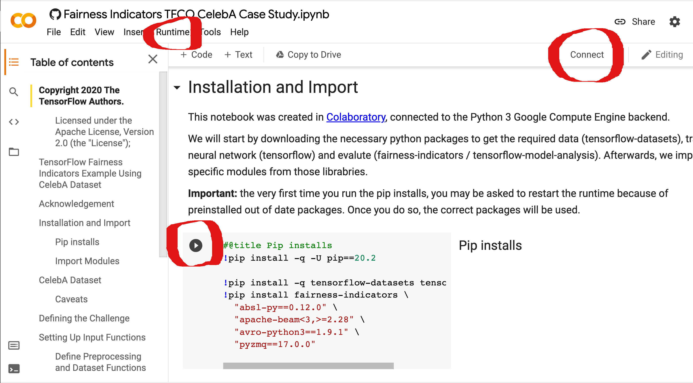
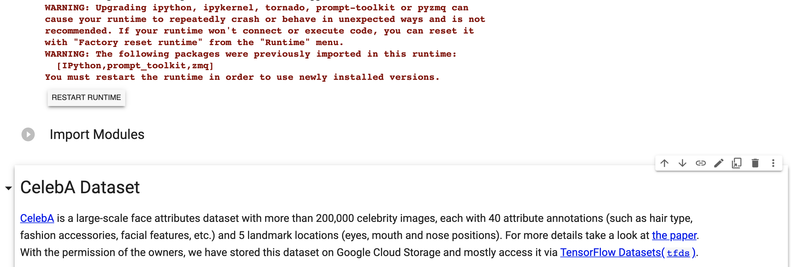

A Workshop on Bias in Machine Learning Applications
============

This repository is supposed to give an easy introduction to Artificial Neural Networks and their inherited biases. It is part of a free workshop series which is not directed to skilled programmers.
 
The material has been gathered and/or modified by [ZKM | Hertz-Lab](https://zkm.de/en/about-the-zkm/organization/hertz-lab) as part of the project [»The Intelligent Museum«](#the-intelligent-museum).

Copyright (c) 2021 ZKM | Karlsruhe.

For information on usage and redistribution, and for a DISCLAIMER OF ALL
WARRANTIES, see the file, "LICENSE.txt," in this distribution.

BSD Simplified License.

Acknowledgement
-----------

We hereby thank TensorFlow for providing tools and examples to explore the topic of bias in Machine Learning (ML) applications.
We introduced small changes to the original notebook in order to suit our needs for this workshop. Please visit the [website](https://www.tensorflow.org/responsible_ai/) to learn more about how TensorFlow gives opportunities to make AI more responsible (including detecting and mitigating bias). Please find the original notebook [here](https://www.tensorflow.org/responsible_ai/fairness_indicators/tutorials/Fairness_Indicators_TFCO_CelebA_Case_Study).

Caveats
-----------
This notebook uses the CelebA dataset. The dataset should not be interpreted as a true representation of the human population. 
It is Insufficient to describe human diversity with binary attributes, i.e. there is no such thing as *young* and *not young*.
Furthermore, human diversity can not be quantified by only 40 attributes.

Nevertheless, it demonstrates perfectly well, how special care needs to be taken when using a not perfectly balanced dataset, to train a neural network to be fair.

How to use this repository
-----------
Here is a quick overview of the necessary steps in this exercise:
- Open the code on Google Colaboratory
- Run the installs section & restart the runtime
- Execute the rest of the code
- Read the text of the mentioned sections
- Explore bias using the Fairness Indicators tool
- Optional: try it yourself by taking a selfie

#### 1 Open the code on Google Colaboratory
For this purpose you will require a Google Account. The code will not be executed on your local machine. Instead you will use compute resources provided by Google.

Please get together in small groups where at least one person has the required access. Next make sure to share your screen and collaboratively go through each step in this exercise.

You can access the code using the following link: https://colab.research.google.com/github/zkmkarlsruhe/bias-workshop/blob/main/Fairness_Indicators_CelebA_Case_Study.ipynb

The above picture points out the most important things to look at.
At the top right corner you will see the status of the environment. At the top left you can see the *Runtime* button we will use in the third step.

#### 2 Run the installs section & restart the runtime
The first code of block to be executed is the installs section. Hover your mouse of the code section and click the *play* button that appears on the left top corner.

If it is the first time you execute these lines you will need to restart the runtime. You should see a button *Restart Runtime* at the end of the logging message.

#### 3 Execute the rest of the code
When the runtime has restarted we will run the rest of the code with a single command. This is necessary as the code will need about 10 minutes to complete.

First go to the next section: imports. Select this section by clicking on it. Next go to the top menu and select *Runtime* -> *Run After* or press CMD/CTRL + F10. Running everything is also fine.

#### 4 Read the text of the sections
With our code running in the background, you can now take a look a each section. The two sections *Setting up the Input Function* & *Fairness Indicators Helper Functions* are only interesting for skilled programmers who want to know more about how we handle the data and use the TFMA library.

We have hidden most of the code, but if you are interested you can peak into it by double clicking on the section (if it is not collapsed yet), but this is not mandatory.

#### 5 Explore bias using the Fairness Indicators tool
When the code has finally evaluated you should see a window at the bottom of the *Train & Evaluate* section.

Using this window we can explore the performance of our recently trained neural network. Please select different metrics on the left. By hovering over a metric with your mouse you should see an explanation of it.

You may want to discuss the following questions:
- Which group has an disadvantage?
- Which metric is most important to you?
- What may cause the gap between the groups?

#### 6 Optional: try it yourself by taking a selfie
If there is some time left for you, you can play around by looking at the outcome of some test images or by taking a selfie.

Keep in mind that the model did not go through all necessary steps to perform good on real world data. This last step is just for demonstration purposes.

Additional Resources
--------------------

- [Original TensorFlow Code](https://colab.research.google.com/github/tensorflow/fairness-indicators/blob/master/g3doc/tutorials/Fairness_Indicators_TFCO_CelebA_Case_Study.ipynb)
- [A survey of Bias in ML](https://arxiv.org/pdf/1908.09635.pdf)
- [An awesome collection of material](https://github.com/datamllab/awesome-fairness-in-ai)

Contribute
----------

Contributions are very welcome! Clone or fork the repo, then request a pull / merge.

If you find any bugs or suggestions please log them here as well.

The Intelligent Museum
----------------------

An artistic-curatorial field of experimentation for deep learning and visitor participation

The [ZKM | Center for Art and Media](https://zkm.de/en) and the [Deutsches Museum Nuremberg](https://www.deutsches-museum.de/en/nuernberg/information/) cooperate with the goal of implementing an AI-supported exhibition. Together with researchers and international artists, new AI-based works of art will be realized during the next four years (2020-2023).  They will be embedded in the AI-supported exhibition in both houses. The Project „The Intelligent Museum“ is funded by the Digital Culture Programme of the [Kulturstiftung des Bundes](https://www.kulturstiftung-des-bundes.de/en) (German Federal Cultural Foundation) and funded by the [Beauftragte der Bundesregierung für Kultur und Medien](https://www.bundesregierung.de/breg-de/bundesregierung/staatsministerin-fuer-kultur-und-medien) (Federal Government Commissioner für Culture and Media).

As part of the project, digital curating will be critically examined using various approaches of digital art. Experimenting with new digital aesthetics and forms of expression enables new museum experiences and thus new ways of museum communication and visitor participation. The museum is transformed to a place of experience and critical exchange.

